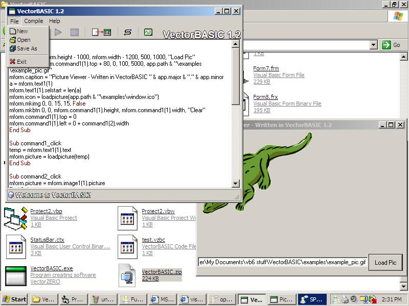



## VectorBASIC 1\.2

### Description

With this program you can write VBScript and have it ran as an EXE. I call it compiling in the program but it is not compiling at all. I couldnt figure out how to make it compile VBScript so I came up with the idea of making the form read an encrypted VBScript source code file in the same directory as the EXE, and the EXE decrypts it and the VBScript OCX runs it. I used functions in the forms to be able to create controls, they are used like this: Mform.MkBtn mform.height - 1000, mform.width - 1200, 500, 1000, "Load Pic". So far the only controls you can create are text boxes, command buttons, and images. In the next submission of VectorBASIC you'll see alot more controls to create. I used arrays and a very unique way of making it so you can set the events for the controls. But the way I have done it, there is a limit for each control, you can only have 1,000 controls of each on the form. The reason I am submitting this before its complete is because im having some issues with clearing the form when the user closes the form. It just creates more arrays... If you have a solution to this problem, it would be greatly appreciated. Now for some more information about this: The menus have icons on the left like VB6, you can open and save codes (it has its own file format), most of the command buttons have icons in them, and it color codes the code just like in VB6, except the code will be different colors. I have givin fill credit where it is due for the other codes and user controls I have used in it (which are displayed in the About). Well.. That pretty much wraps it up. Comments, and a solution to the form issue is greatly appreciated!
 
### More Info
 

             |
---                |---
**Submitted On**   |2004-03-05 20:22:42
**By**             |[Jesse Seidel \(Dr\. Fire\)](https://github.com/Planet-Source-Code/PSCIndex/blob/master/ByAuthor/jesse-seidel-dr-fire.md)
**Level**          |Advanced
**User Rating**    |5.0 (60 globes from 12 users)
**Compatibility**  |VB 6\.0
**Category**       |[Complete Applications](https://github.com/Planet-Source-Code/PSCIndex/blob/master/ByCategory/complete-applications__1-27.md)
**World**          |[Visual Basic](https://github.com/Planet-Source-Code/PSCIndex/blob/master/ByWorld/visual-basic.md)
**Archive File**   |[VectorBASI171724372004\.zip](https://github.com/Planet-Source-Code/jesse-seidel-dr-fire-vectorbasic-1-2__1-52204/archive/master.zip)

